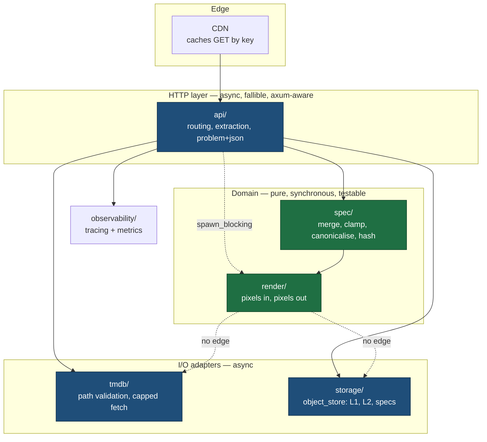

# Implementation plan — Poster Service v1

An HTTP API that composites custom movie posters from TMDB artwork: a
background image, a gradient gaussian blur rising from the bottom edge, a
darkening ramp for legibility, a title logo, and a row of text-driven badges.

Target: **p50 < 80 ms, p99 < 250 ms** per render at w1000, **1–20 req/s** peak,
**> 90 %** cache hit rate in steady state.

---

## 1. Scope and non-goals

### In scope for v1

- `POST /v1/posters` → validate, resolve, hash, persist spec, return key and URL.
- `GET /v1/posters/{key}.webp` → render or serve from cache, immutably cacheable.
- `GET /v1/presets` → preset catalogue with resolved defaults.
- Backgrounds sourced exclusively from `image.tmdb.org`, addressed by
  `poster_path`, never by client-supplied URL.
- Output: WebP at w1000 (1000×1500) by default, w2000 (2000×3000) opt-in.
- Two cache tiers in object storage, plus spec persistence.
- Prometheus metrics, structured JSON logs, liveness and readiness probes.

### Explicit non-goals

| Not in v1 | Why |
|---|---|
| AVIF output | `ravif` encodes an order of magnitude slower than libwebp; it cannot sit on the request path at these latency targets. Revisit as an async pre-warm. |
| Arbitrary source URLs | The single most effective SSRF control is to make user-supplied URLs unrepresentable. See § 6. |
| Client image uploads | Adds a storage quota, a content-safety problem and a virus-scanning problem, none of which the product needs yet. |
| Animated or video posters | Different codec and latency envelope entirely. |
| Authentication, quotas, billing | Deployed behind a gateway that already terminates these. |
| Multi-region storage | One bucket plus CDN covers 20 req/s with room to spare. |
| Redis | See `docs/adr/0003`. |

---

## 2. Architecture overview



The dotted "no edge" arrows are the load-bearing part of this diagram.
`render/` takes a `&ResolvedSpec` and byte buffers and returns pixels. It has
no `async fn`, no `reqwest`, no `axum`, no `object_store`. Three consequences
follow, and they are the reason the boundary exists:

1. Every rendering behaviour is unit-testable without a runtime, a network
   stub or a temp directory.
2. Two versions of the renderer can be run over identical inputs and compared
   pixel by pixel, which is what makes the visual regression gate meaningful.
3. `rayon` can be used freely inside the render without any risk of blocking a
   tokio worker, because the whole call already sits inside `spawn_blocking`.

The rule is enforced mechanically by `tests/module_boundary.rs`, which walks
`src/render/` and fails on `reqwest`, `object_store`, `axum`, `async fn`,
`.await` or `tokio::`.

It deliberately does *not* use a clippy `disallowed-types` entry.
`clippy.toml` applies to the whole crate, so banning `reqwest::Client` there
would also fire in `state.rs`, where the client legitimately lives — the rule
is about a directory, and only a directory-scoped check can express it.

---

## 3. Crate layout

A single binary crate with a library target. Not a workspace: the module
boundary above is the one that matters, and it is enforced by a directory-
scoped test rather than by crate separation. Splitting `render/` into its own crate becomes worthwhile
only if a second binary needs it (see § 14.5).

| Path | Responsibility |
|---|---|
| `src/main.rs` | Binary entrypoint: load config, init tracing and metrics, bind listener, graceful shutdown. The only place `anyhow` appears. |
| `src/lib.rs` | Crate root. `#![forbid(unsafe_code)]`, `#![warn(missing_docs)]`, module tree, `RENDER_VERSION`. |
| `src/config.rs` | `Config` loaded via figment from env and optional file; secrets wrapped in `secrecy::SecretString`. |
| `src/state.rs` | `AppState`: storage handle, HTTP client, render semaphore, singleflight map. |
| `src/api/mod.rs` | Router assembly and tower-http layers: trace, timeout, request body limit, concurrency. |
| `src/api/posters.rs` | `POST /v1/posters` and `GET /v1/posters/{key}.webp`. |
| `src/api/presets.rs` | `GET /v1/presets`. |
| `src/api/health.rs` | `GET /healthz`, `GET /readyz`. |
| `src/api/error.rs` | `ApiError` → `IntoResponse`, RFC 9457 `application/problem+json` bodies. |
| `src/spec/mod.rs` | Module invariants and re-exports. |
| `src/spec/request.rs` | `PosterRequest`, `Overrides`: the wire shape and its syntactic validation. |
| `src/spec/resolved.rs` | `ResolvedSpec`: post-merge, post-clamp, canonical. The only input the renderer accepts. |
| `src/spec/preset.rs` | Preset catalogue embedded at compile time; merge of preset with overrides. |
| `src/spec/clamp.rs` | Every numeric limit in the system, in one file. |
| `src/spec/key.rs` | `CacheKey`: field-ordered blake3 hashing including `RENDER_VERSION`. |
| `src/render/mod.rs` | `render(&ResolvedSpec, &Assets) -> Result<Rgba8Image, RenderError>`. |
| `src/render/pipeline.rs` | Stage sequencing and per-stage timing spans. |
| `src/render/blur.rs` | Downscale → three box passes → upscale, with SVG-spec box sizing. |
| `src/render/gradient.rs` | Alpha ramp generation for the blur band and the darkening layer. |
| `src/render/badges.rs` | Text measurement, pill geometry, SVG construction, resvg rasterisation. |
| `src/render/logo.rs` | Alpha-aware fit and placement of the title logo. |
| `src/render/fonts.rs` | `fontdb::Database` built from `include_bytes!` faces; never touches system fonts. |
| `src/render/encode.rs` | WebP encoding. |
| `src/tmdb/mod.rs` | `PosterPath` newtype: strict validation, server-side URL construction. |
| `src/tmdb/fetch.rs` | Byte-capped streaming fetch and pre-decode dimension guard. |
| `src/storage/mod.rs` | `Storage` trait over `object_store`; L1, L2 and spec operations. |
| `src/storage/keys.rs` | Object path layout. |
| `src/observability/mod.rs` | Tracing subscriber setup and metric descriptor registration. |
| `assets/fonts/` | Embedded font faces with their licences. |
| `assets/presets.toml` | Preset catalogue, embedded via `include_str!`. |
| `tests/` | Integration tests: HTTP round trip against wiremock and in-memory storage. |
| `tests/module_boundary.rs` | Fails the build if `src/render/` acquires an async or I/O dependency. |
| `tests/visual/` | Reference PNG files and the perceptual comparison harness. |
| `benches/` | criterion benchmarks: blur, resize, encode, end-to-end. |

---

## 4. Core types

Signatures and documentation only. Bodies are written in the milestones of § 9.

```rust
/// A poster generation request as it arrives on the wire.
///
/// This is the *unresolved* shape: `preset` names a layout, `overrides`
/// carries per-request deviations from it, and neither has been clamped yet.
/// Nothing in this type may be hashed — see [`crate::spec::key`] for why.
#[derive(Debug, Clone, serde::Deserialize)]
#[serde(deny_unknown_fields)]
pub struct PosterRequest {
    /// TMDB path of the background artwork, for example `/abc123.jpg`.
    pub source: PosterPath,
    /// Which TMDB image family `source` belongs to.
    #[serde(default)]
    pub source_kind: SourceKind,
    /// Named layout preset. Defaults to `"standard"`.
    #[serde(default)]
    pub preset: PresetName,
    /// Optional title logo, also addressed by TMDB path.
    #[serde(default)]
    pub logo: Option<PosterPath>,
    /// Badges rendered as a row along the top edge, left to right.
    #[serde(default)]
    pub badges: Vec<Badge>,
    /// Output width. Defaults to [`OutputWidth::W1000`].
    #[serde(default)]
    pub width: OutputWidth,
    /// Per-request deviations from the preset.
    #[serde(default)]
    pub overrides: Overrides,
}

/// Per-request deviations from a preset.
///
/// Every field is optional. `None` means "inherit from the preset"; it does
/// not mean "zero". This distinction is why the type cannot be flattened into
/// [`Preset`] and why merging is explicit rather than derived.
#[derive(Debug, Clone, Default, serde::Deserialize)]
#[serde(deny_unknown_fields)]
pub struct Overrides {
    /// Height of the blurred band as a fraction of poster height.
    pub blur_band_fraction: Option<f32>,
    /// Gaussian sigma at w1000, in pixels. Scaled linearly for w2000.
    pub blur_sigma: Option<f32>,
    /// Peak opacity of the darkening ramp, at the bottom edge.
    pub darken_strength: Option<f32>,
    /// Logo width as a fraction of poster width.
    pub logo_width_fraction: Option<f32>,
    /// Distance from the bottom edge to the logo baseline, as a fraction.
    pub logo_bottom_fraction: Option<f32>,
    /// Badge row height in pixels at w1000.
    pub badge_height: Option<u32>,
}

/// A fully resolved, clamped, canonical render specification.
///
/// # Invariants
///
/// - Produced only by [`Preset::resolve`]; there is no other constructor.
/// - Every numeric field has passed through [`crate::spec::clamp`] and is
///   therefore within its documented range.
/// - Field order in this struct is the hashing order. Reordering fields
///   changes every cache key, which is why it is paired with `RENDER_VERSION`.
/// - Two `PosterRequest`s that differ only in ways the renderer ignores must
///   resolve to the same `ResolvedSpec`. That property is what makes the
///   cache hit rate achievable.
#[derive(Debug, Clone, PartialEq, serde::Serialize)]
pub struct ResolvedSpec {
    pub source: PosterPath,
    pub source_kind: SourceKind,
    pub logo: Option<PosterPath>,
    pub badges: Vec<Badge>,
    pub width: OutputWidth,
    pub blur_band_fraction: f32,
    pub blur_sigma: f32,
    pub darken_strength: f32,
    pub logo_width_fraction: f32,
    pub logo_bottom_fraction: f32,
    pub badge_height: u32,
}

impl ResolvedSpec {
    /// Computes the content-addressed cache key for this specification.
    ///
    /// Hashes each field in declaration order with an explicit length prefix
    /// for variable-length data, then mixes in `RENDER_VERSION`. Serde is
    /// deliberately not involved: `serde_json` makes no stable guarantee
    /// about map key ordering or float formatting across versions, and a
    /// silent change in either would orphan the entire cache.
    ///
    /// # Returns
    ///
    /// A 32-byte blake3 digest, rendered as 64 lowercase hex characters.
    pub fn cache_key(&self) -> CacheKey;
}

/// A named layout preset.
#[derive(Debug, Clone, serde::Deserialize)]
pub struct Preset {
    pub name: PresetName,
    pub blur_band_fraction: f32,
    pub blur_sigma: f32,
    pub darken_strength: f32,
    pub logo_width_fraction: f32,
    pub logo_bottom_fraction: f32,
    pub badge_height: u32,
}

impl Preset {
    /// Merges a request and its overrides into a canonical specification.
    ///
    /// Clamping happens *after* merging, never before. Clamping the override
    /// and then merging would let two different requests survive as distinct
    /// specifications that render identically, splitting one cache entry into
    /// two and costing a render.
    ///
    /// # Arguments
    ///
    /// * `request` — the validated wire request.
    ///
    /// # Returns
    ///
    /// A [`ResolvedSpec`] satisfying every invariant documented on that type.
    ///
    /// # Errors
    ///
    /// Returns [`SpecError::UnknownPreset`] if `request.preset` is not in the
    /// catalogue, and [`SpecError::TooManyBadges`] if the badge row cannot fit.
    pub fn resolve(&self, request: PosterRequest) -> Result<ResolvedSpec, SpecError>;
}

/// A single badge in the top row.
///
/// Width is derived from the rendered text advance, not supplied by the
/// client: a client-supplied width would let the caller request a badge
/// narrower than its own text and produce clipped output.
#[derive(Debug, Clone, PartialEq, serde::Deserialize, serde::Serialize)]
#[serde(deny_unknown_fields)]
pub struct Badge {
    /// Badge text. Limited to 32 grapheme clusters after NFC normalisation.
    pub text: String,
    /// Visual treatment.
    #[serde(default)]
    pub style: BadgeStyle,
}

/// Every error the API can return.
///
/// Each variant maps to exactly one HTTP status and one stable machine code.
/// The machine code is part of the public contract: clients branch on it, so
/// renaming a variant is a breaking change even though the type is internal.
#[derive(Debug, thiserror::Error)]
pub enum ApiError {
    #[error("poster path is not a valid TMDB path")]
    InvalidPosterPath,
    #[error("request failed validation: {0}")]
    ValidationFailed(String),
    #[error("unknown preset: {0}")]
    UnknownPreset(String),
    #[error("no specification stored for this key")]
    UnknownKey,
    #[error("upstream artwork not found")]
    SourceNotFound,
    #[error("upstream timed out")]
    UpstreamTimeout,
    #[error("upstream unavailable: {0}")]
    UpstreamUnavailable(String),
    #[error("upstream response exceeded the byte cap")]
    SourceTooLarge,
    #[error("source dimensions exceed the decode guard")]
    SourceDimensionsExceeded { width: u32, height: u32 },
    #[error("could not decode upstream artwork")]
    SourceDecodeFailed,
    #[error("render capacity exhausted")]
    Overloaded,
    #[error("storage unavailable: {0}")]
    StorageUnavailable(String),
    #[error("render failed: {0}")]
    RenderFailed(String),
}

/// Shared application state, cloned per request.
///
/// Every field is either `Arc`-wrapped or internally shared, so `Clone` is a
/// refcount bump rather than a copy.
#[derive(Clone)]
pub struct AppState {
    /// Configuration, immutable after startup.
    pub config: Arc<Config>,
    /// Object storage for L1, L2 and specs.
    pub storage: Arc<dyn Storage>,
    /// Upstream client: explicit timeout, redirects disabled.
    pub http: reqwest::Client,
    /// Bounds concurrent renders. Sized to the CPU count, not to the
    /// connection count: renders are CPU-bound, so admitting more than one
    /// per core trades latency for no additional throughput.
    pub render_slots: Arc<Semaphore>,
    /// Collapses concurrent misses on the same key into a single render.
    pub inflight: Arc<DashMap<CacheKey, Weak<Notify>>>,
}
```

---

## 5. Render pipeline

Stages run in this order. The budget column is the target at w1000 with an L1
hit, measured on one core of a modern x86-64 server part. It is a *render*
budget: it starts when the source bytes are in memory and ends when the WebP
buffer is complete. What it excludes is discussed in § 14.1.

| # | Stage | Budget | Why this way |
|---|---|---|---|
| 1 | Decode source | 8 ms | `zune-jpeg` is measurably faster than the `image` JPEG path and does not pull the whole `image` codec surface. Dimensions are read from the header first and checked against the guard *before* any pixel buffer is allocated. |
| 2 | Resize to target | 6 ms | `fast_image_resize` with Lanczos3, SIMD-dispatched at runtime. Resize happens before every other stage so that all subsequent work is at output resolution and no stage pays for pixels that will be discarded. |
| 3 | Blur band | 3 ms | Downscale ÷8, three box passes, upscale. Argument below. |
| 4 | Composite blur band | 2 ms | The blurred band is composited back through a feathered alpha ramp so the band's top edge dissolves instead of showing a seam. |
| 5 | Darkening ramp | 2 ms | A single linear alpha ramp applied in place. Runs after the blur so it darkens the blurred result rather than being smeared by it. |
| 6 | Logo composite | 3 ms | `tiny-skia` with premultiplied alpha. |
| 7 | Badge row | 12 ms | `fontdb` measures each string, geometry is computed, one SVG is built for the whole row and rasterised once by `resvg`. One rasterisation for the row rather than one per badge: `usvg` parsing dominates, and it is per-document, not per-node. |
| 8 | Encode WebP | 22 ms | libwebp, quality 82, method 4. Method 4 is the knee of the quality-per-millisecond curve; method 6 costs roughly 2.5× the time for a difference that does not survive a blind comparison at this size. |
| | **Total** | **≈ 58 ms** | 22 ms of headroom against the 80 ms p50 target. |

The two stages worth arguing for explicitly:

### 5.1 Why downscale, blur, upscale

A separable gaussian convolution is `O(w·h·r)` for radius `r`. A box blur
implemented as a sliding-window sum is `O(w·h)` and **independent of radius**,
because widening the window adds no work per output pixel.

Downscaling by a factor `k` before blurring is a second, multiplicative win:
it divides the pixel count by `k²` *and* divides the radius required for the
same visual result by `k`.

The approximation is sound rather than merely cheap. The output of this stage
is by construction a low-frequency field — that is what a blur produces. The
detail discarded by downscaling lives in frequencies above the blur's cutoff,
so it would have been destroyed by the blur regardless. At `k = 8` and the
sigmas the presets use, the difference from a full-resolution gaussian is
below the perceptual threshold and, more usefully, below the tolerance the
visual regression harness enforces.

### 5.2 Why three box passes approximate a gaussian

Convolving box kernels repeatedly converges to a gaussian: it is the central
limit theorem applied to kernels rather than to random variables. Three passes
is the standard stopping point, and it is not folklore — SVG 1.1 specifies it
normatively for `feGaussianBlur`:

> if the standard deviation is greater than 2.0, apply three successive box
> blurs, using box size `d = floor(s · 3 · sqrt(2·PI)/4 + 0.5)`

*(SVG 1.1, § 15.17, Filter Effects: feGaussianBlur.)*

The implementation uses that exact box-size formula, including the spec's
handling of even `d` (two passes of size `d`, one of size `d+1`, with the
offsets it prescribes). Two reasons for following the spec rather than
inventing a formula: output matches what a browser produces for the same
sigma, which makes design iteration in a browser meaningful; and the constant
is chosen so that the box sequence has the same variance as the target
gaussian, which is the property that makes three passes sufficient.

### 5.3 Parallelism

Stages 3–6 are row-parallel over disjoint slices and use `rayon`. Stages 1, 2
and 8 are already internally parallel or SIMD-dispatched inside their crates.
The whole `render` call runs inside `spawn_blocking`, so rayon never contends
with the tokio worker pool.

---

## 6. Security model

### 6.1 SSRF is eliminated, not filtered

The API never accepts a URL. It accepts a `poster_path` matching:

```
^/[A-Za-z0-9]{20,60}\.(jpg|png|webp)$
```

and constructs `{TMDB_IMAGE_BASE}/{size}{poster_path}` server-side. There is no
input that produces a request to a host other than the configured base. This
is a structural guarantee rather than a blocklist, which matters because
blocklists lose to DNS rebinding, IPv6-mapped addresses, redirect chains and
decimal IP encodings, whereas "the host is a compile-time-adjacent constant"
loses to none of them.

`redirect::Policy::none()` on the client closes the remaining gap: a
compromised or misconfigured CDN cannot redirect the fetch to an internal
address.

### 6.2 Decompression bombs

Two independent guards, both before allocation:

1. **Byte cap.** The upstream body is read as a stream and abandoned the
   moment it exceeds 20 MB. `Content-Length` is advisory and is not trusted;
   the cap is enforced against bytes actually read.
2. **Dimension guard.** Image dimensions are parsed from the file header and
   rejected above 8000 px per side *before* the decoder allocates. A 40 KB
   JPEG can legitimately declare dimensions that decode to several gigabytes,
   so a byte cap alone does not bound memory.

### 6.3 Other controls

| Control | Setting |
|---|---|
| Upstream timeout | 3 s total, explicit; no reliance on defaults |
| Request body limit | 16 KB on `POST /v1/posters` via tower-http |
| Badge text | NFC-normalised, 32 grapheme clusters max, control characters stripped before it reaches the SVG builder |
| SVG construction | Text is XML-escaped; the SVG is built from a typed structure, never by string interpolation of user input |
| Fonts | Embedded via `include_bytes!`; `fontdb` is never allowed to load system fonts, so rendering is identical everywhere and no font-file path is reachable from a request |
| `unsafe` | `#![forbid(unsafe_code)]` at crate root |

---

## 7. Backpressure and singleflight

Renders are CPU-bound, so the admission limit is `num_cpus`, not a connection
count. Admitting more work than there are cores raises latency without raising
throughput.

Admission uses a **bounded wait**, not a bare `try_acquire`: `acquire` with a
50 ms timeout. The reasoning is in § 14.3 — a strict `try_acquire` rejects on
transient bursts that the queue would have absorbed well inside the latency
budget. On timeout the response is `503` with `Retry-After: 1`.

Singleflight collapses concurrent misses on one key. `DashMap<CacheKey,
Weak<Notify>>` holding weak references so entries self-clean when the last
waiter drops, avoiding the unbounded-map leak that a strong-reference version
develops under key churn. First arrival renders; the rest await the `Notify`
and then re-read L2.

Without this, a cold key going viral produces one render per concurrent
request — exactly the shape of load that saturates the semaphore and turns a
cache miss into an outage.

---

## 8. Error taxonomy

Bodies are RFC 9457 `application/problem+json`. The `code` field is a stable
part of the public contract.

| Variant | Status | Code | Retryable |
|---|---|---|---|
| `InvalidPosterPath` | 400 | `invalid_poster_path` | No |
| `UnknownPreset` | 400 | `unknown_preset` | No |
| `ValidationFailed` | 422 | `validation_failed` | No |
| `SourceDimensionsExceeded` | 422 | `source_dimensions_exceeded` | No |
| `UnknownKey` | 404 | `unknown_key` | No |
| `SourceNotFound` | 404 | `source_not_found` | No |
| `SourceTooLarge` | 502 | `source_too_large` | No |
| `SourceDecodeFailed` | 502 | `source_decode_failed` | No |
| `UpstreamUnavailable` | 502 | `upstream_unavailable` | Yes |
| `UpstreamTimeout` | 504 | `upstream_timeout` | Yes |
| `Overloaded` | 503 | `overloaded` | Yes, `Retry-After: 1` |
| `StorageUnavailable` | 503 | `storage_unavailable` | Yes, `Retry-After: 2` |
| `RenderFailed` | 500 | `render_failed` | No |

Two choices worth stating. `SourceNotFound` is 404 rather than 502 because the
client named artwork that does not exist — that is a client error about a
resource, and returning 502 would invite a retry that cannot succeed.
`SourceTooLarge` is 502 rather than 413 because the oversized payload is the
upstream's, not the client's; 413 would tell the caller to shrink a request
body they did not send.

`Cache-Control` on errors is `no-store`, with one exception: `UnknownKey` is
cacheable for 60 s, because an unknown key is unknown permanently and the CDN
should absorb the retry storm that follows a bad link being shared.

---

## 9. Configuration

| Name | Required | Secret | Purpose |
|---|---|---|---|
| `BIND_ADDR` | No (`0.0.0.0:8080`) | No | Listen address |
| `LOG_FORMAT` | No (`json`) | No | `json` in production, `pretty` locally |
| `LOG_LEVEL` | No (`info`) | No | Tracing filter |
| `STORAGE_BACKEND` | Yes | No | `s3`, `local` or `memory` |
| `STORAGE_BUCKET` | If `s3` | No | Bucket name |
| `STORAGE_LOCAL_PATH` | If `local` | No | Root directory |
| `S3_ENDPOINT` | No | No | Set for MinIO, R2 or any S3-compatible host |
| `AWS_REGION` | If `s3` | No | Region |
| `AWS_ACCESS_KEY_ID` | If `s3` | **Yes** | Credential |
| `AWS_SECRET_ACCESS_KEY` | If `s3` | **Yes** | Credential |
| `TMDB_IMAGE_BASE` | No (`https://image.tmdb.org/t/p`) | No | CDN base; the only host ever contacted |
| `TMDB_API_KEY` | **No** | **Yes** | See note below |
| `MAX_UPSTREAM_BYTES` | No (`20971520`) | No | Streaming byte cap |
| `MAX_SOURCE_DIMENSION` | No (`8000`) | No | Pre-decode dimension guard |
| `RENDER_CONCURRENCY` | No (`num_cpus`) | No | Semaphore permits |
| `RENDER_ACQUIRE_TIMEOUT_MS` | No (`50`) | No | Bounded admission wait |
| `UPSTREAM_TIMEOUT_MS` | No (`3000`) | No | Total upstream timeout |
| `L1_TTL_DAYS` | No (`30`) | No | Resized-background tier lifetime |

**`TMDB_API_KEY` is not required.** Clients supply `poster_path` directly, and
`image.tmdb.org` serves artwork without authentication. The key is needed only
if a future endpoint resolves a TMDB *id* to a path on the client's behalf,
which v1 does not do. It is listed here so the omission is visibly deliberate
rather than an oversight — a service that requires no credential to fetch its
primary input is a meaningfully smaller thing to operate.

Secrets are wrapped in `secrecy::SecretString` so that `#[derive(Debug)]` on
`Config` cannot leak them into a log line.

---

## 10. Cache and storage

| Tier | Path | Content | Lifetime |
|---|---|---|---|
| L1 | `l1/{source_hash}/{width}.webp` | Source artwork, resized to target, WebP q90 | 30 days |
| L2 | `l2/{key}.webp` | Final rendered poster | Immutable |
| Spec | `spec/{key}.json` | The `ResolvedSpec` that produced the key | Immutable |

`GET` responses carry `Cache-Control: public, max-age=31536000, immutable`.
That header is only honest because the key is a hash of the resolved spec
*including* `RENDER_VERSION`: bumping the constant changes every key, so a
renderer change can never be served from a stale entry. There is no
invalidation path and none is needed, which is the whole point of content
addressing.

L1 exists because the resize is the second most expensive stage and its result
is shared across every poster built from the same artwork at the same width.
It is quality 90 rather than 82 because it is an intermediate that will be
re-encoded; compounding lossy encodes at the delivery quality visibly degrades
the result.

---

## 11. Test plan

Six layers, each responsible for something the others cannot cover.

### 11.1 Unit tests

| Target | What is asserted |
|---|---|
| `spec/preset.rs` | Merge precedence: override beats preset beats default; `None` inherits and does not zero |
| `spec/clamp.rs` | Every field clamps at both ends; clamping is idempotent |
| `spec/key.rs` | Determinism across runs and across process restarts; `RENDER_VERSION` changes the key |
| `tmdb/mod.rs` | Path regex accepts real TMDB paths; rejects `..`, absolute URLs, protocol-relative URLs, null bytes, unicode lookalikes |
| `tmdb/fetch.rs` | Byte cap fires on a body larger than the cap even when `Content-Length` lies or is absent; dimension guard fires before allocation |
| `render/blur.rs` | Box sizes match the SVG 1.1 formula for a table of sigmas |
| `tests/module_boundary.rs` | `src/render/` contains no async, HTTP or storage dependency |
| `render/badges.rs` | Text is XML-escaped; grapheme limit is enforced on clusters, not bytes |

### 11.2 Property tests (proptest)

- **Resolution is total.** Any `PosterRequest` that passes validation resolves
  without panicking.
- **Clamping is idempotent.** `clamp(clamp(x)) == clamp(x)` for arbitrary `f32`
  including subnormals, infinities and NaN.
- **Key stability.** Requests that resolve to equal `ResolvedSpec`s always
  produce equal keys.
- **Canonical encoding is injective.** Distinct `ResolvedSpec`s produce
  distinct pre-hash byte strings. This is the honest form of "distinct specs
  must not collide" — see § 14.4 for why the collision phrasing is not testable
  and this one is.

### 11.3 Snapshot tests (insta)

Resolved spec JSON for every preset; the preset catalogue response; one error
body per `ApiError` variant. These are the API contract, and a snapshot diff
is the review prompt that a contract change deserves.

### 11.4 Visual regression

Fixed synthetic fixtures — generated gradients and shapes, not TMDB artwork,
so nothing copyrighted enters the repository — rendered and compared against
committed reference PNG files.

Two rules make this gate meaningful rather than flaky:

1. **Compare pre-encode pixmaps, not WebP bytes.** libwebp output is not
   bit-stable across library versions; comparing encoded bytes would fail CI
   on a libwebp bump that changed nothing visible. References are stored as
   lossless PNG and compared against the RGBA buffer at stage 7.
2. **Perceptual tolerance, not exact equality.** SIMD dispatch differs across
   runners, so exact equality is unachievable. The harness asserts mean
   absolute error below a threshold and no single-channel deviation above a
   ceiling.

**A visual diff without a `RENDER_VERSION` bump fails CI.** This is the guard
that keeps the cache honest: it makes it structurally impossible to change
what the renderer produces without changing every key that renderer produces.

### 11.5 Integration tests

Full HTTP round trip: `POST` then `GET`, against a `wiremock` TMDB stub and
`object_store`'s `InMemory` backend. No network, no containers, no cloud
credentials — which is what makes them runnable in CI and on a laptop alike.

Covered: the POST/GET handshake; a second identical POST returning the same
key; L2 hit path; singleflight collapsing concurrent misses to one upstream
fetch; 503 under semaphore exhaustion; upstream 404 surfacing as
`source_not_found`; oversized upstream body rejected.

### 11.6 Benchmarks (criterion)

`blur`, `resize`, `encode`, and `render_end_to_end`. The blur benchmark is
parameterised over the downscale factor so the ÷8 choice stays evidence-backed
rather than inherited, and includes a full-resolution gaussian as the baseline
the optimisation is measured against.

### 11.7 Tooling

`cargo-nextest` as the runner. `cargo-llvm-cov` for coverage, gated at **85 %
on `src/render/` and `src/spec/`** and ungated elsewhere. A blanket
crate-wide percentage would be satisfied by testing `main.rs` wiring and would
say nothing about the two modules where a bug is either a visual defect or a
cache-poisoning event.

---

## 12. Milestones

Every milestone is a short-lived branch, squash-merged into `main`. CI gates
listed per milestone are cumulative.

### M0 — Repository foundation *(complete)*

Branch `chore/repo-hygiene`, `docs/implementation-plan`,
`docs/architecture-decisions`, `chore/scaffold-service`, `ci/pipeline`.

Tag: **`v0.0.1`**.

### M1 — Spec resolution and cache keys

Branch `feat/spec-resolution`. Gates: `fmt`, `clippy`, `test`, `deny`.

```
feat: add poster request and override types
feat: embed preset catalogue and implement merge
feat: clamp resolved specifications to documented ranges
feat: derive content-addressed cache keys with blake3
test: assert key stability and canonical encoding injectivity
```

### M2 — TMDB source access

Branch `feat/tmdb-source`. Gates: as M1.

```
feat: validate TMDB poster paths and build CDN urls server-side
feat: cap upstream responses by streamed byte count
feat: reject oversized source dimensions before decode
test: cover ssrf and decompression bomb guards
```

### M3 — Storage layer

Branch `feat/storage`. Gates: as M1.

```
feat: define storage trait over object_store
feat: implement l1, l2 and specification paths
test: exercise storage against the in-memory backend
```

### M4 — Render pipeline

Branch `feat/render-pipeline`. Gates: as M1, plus `visual`.

```
feat: decode and resize source artwork
feat: approximate gaussian blur with three box passes
feat: composite blur band through a feathered alpha ramp
feat: apply darkening gradient for text legibility
feat: place title logo with alpha-aware fit
feat: rasterise text-driven badge row
feat: encode rendered posters as webp
test: add visual regression harness and reference fixtures
bench: measure blur, resize and encode stages
```

Tag: **`v0.1.0`** — first version that renders a poster.

### M5 — HTTP surface

Branch `feat/http-api`. Gates: as M4.

```
feat: add poster creation and retrieval endpoints
feat: return rfc 9457 problem responses
feat: serve the preset catalogue
feat: add liveness and readiness probes
test: cover the http round trip against a wiremock upstream
```

### M6 — Backpressure and observability

Branch `feat/backpressure`. Gates: as M4.

```
feat: bound concurrent renders with a timed semaphore
feat: collapse concurrent misses with singleflight
feat: expose prometheus metrics for render stages
feat: emit structured json logs with request correlation
test: assert overload returns 503 with retry-after
```

Tag: **`v0.2.0`** — feature-complete for v1.

### M7 — Release engineering

Branch `chore/release`. Gates: all, plus `build-release`.

```
ci: build musl and gnu images and publish to ghcr
docs: document deployment and configuration
chore: generate changelog from commit history
```

Tag: **`v1.0.0`**.

---

## 13. Risk register

| Risk | Blast radius | Mitigation |
|---|---|---|
| `webp` crate links system libwebp, breaking the static musl image | Release build fails; no runtime impact | Build with the vendored libwebp feature and verify in CI on the musl target from M0, not at M7 when it would block a release. Fallback in § 14.2. |
| Renderer change ships without a `RENDER_VERSION` bump | **Severe and silent.** Every cached poster serves stale pixels behind an `immutable` header with a one-year max-age, and there is no invalidation path | Visual regression diff without a version bump is a hard CI failure. This is the single most important gate in the pipeline. |
| Latency target missed once badges are real | Missed p99; degraded UX under load | Benchmarks from M4, before the HTTP layer exists to hide the cost. Budget in § 5 has 22 ms of headroom. |
| TMDB CDN slow or unavailable | Cold renders fail; cached posters unaffected | 3 s timeout, retryable error codes, L1 covers repeat sources for 30 days |
| Cache hit rate below 90 % because equivalent requests produce distinct keys | Cost and latency, quietly — the service works, it is just several times more expensive than it should be | Hash the resolved and clamped spec, never the raw request; property test asserts equivalent requests collide onto one key |
| Font licensing | Legal | Only OFL or Apache-2.0 faces, licence files committed alongside the fonts, `cargo-deny` covers crates but fonts are checked by hand at review |
| Unbounded singleflight map under key churn | Slow memory growth | `Weak<Notify>` entries self-clean when the last waiter drops |
| Upstream artwork replaced under the same path | Stale background served indefinitely | Accepted for v1: TMDB paths are content-addressed upstream, so a changed image is a changed path |

---

## 14. Open questions and challenges

These are places where the brief is either underspecified or, in two cases,
asks for something that cannot be delivered as stated.

### 14.1 The latency target needs a defined start point

**p50 < 80 ms at w1000, cold cache** is not achievable if the clock includes
the TMDB fetch. Round-trip time to `image.tmdb.org` is typically 30–80 ms
before a byte of artwork arrives, so a 58 ms render leaves the end-to-end p50
somewhere near 110–140 ms — and none of that gap is addressable by anything in
this codebase.

This plan reads the target as **render time with source bytes in hand**, which
is the number the service can actually be held to. If the intended reading is
end-to-end including the upstream fetch, the honest response is to change the
target rather than the code, and to state the two numbers separately:
render-time p50 < 80 ms, and end-to-end cold-cache p50 < 200 ms.

Worth noting that this only affects cold requests. At the stated > 90 % hit
rate, the number nearly every client experiences is the L2 hit path — storage
read plus response write, comfortably under 20 ms.

### 14.2 WebP encoding and the static musl build

The `webp` crate is a binding to libwebp, so the release image needs libwebp
either vendored and statically linked or present in the runtime image. The
vendored path is the intended one and is verified from M0.

The obvious pure-Rust fallback does not work: `image-webp` encodes **lossless
only**, so it cannot produce the quality-82 lossy output the size budget
assumes. If vendoring proves unworkable, the real choice is a glibc image
rather than a pure-Rust encoder — which is a smaller concession than it
sounds, and is the reason `build-release` builds both targets.

### 14.3 `try_acquire` is the wrong admission primitive here

The brief specifies `try_acquire` rather than `acquire`, to avoid an unbounded
queue. The goal is right; the primitive is too blunt for this workload.

At 20 req/s and 58 ms renders, mean concurrency is about 1.2. On an 8-core
box, a bare `try_acquire` only rejects when 8 renders are already in flight —
a burst that would have drained in well under 100 ms, comfortably inside the
250 ms p99 budget. Rejecting it converts a satisfiable request into a 503.

This plan uses `acquire` with a **50 ms timeout** instead. That is still a
bounded queue — the failure mode `try_acquire` exists to prevent — but it
absorbs the bursts that are the actual traffic shape. The 50 ms bound is
derived, not arbitrary: it is the largest wait that still leaves a full render
inside the 250 ms p99 target with margin. If measurement shows queueing beyond
that, the answer is more cores, not a longer queue.

### 14.4 "Distinct specs must not collide" cannot be tested

The brief asks for a property test asserting that distinct specs do not
collide. No test can establish that. A proptest samples a vanishing fraction
of the input space, and blake3 collision resistance is a cryptographic
assumption rather than a property that a test run can confirm — a test that
appears to verify it is verifying nothing while looking rigorous.

The testable property that carries the same weight is **injectivity of the
canonical pre-hash encoding**: distinct `ResolvedSpec`s produce distinct byte
strings before hashing. That *is* falsifiable, and it catches the failure that
actually happens in practice — a field omitted from the hash, or an ambiguous
encoding where two different specs serialise identically because a length
prefix is missing. Collision resistance then follows from blake3 rather than
from the test suite. § 11.2 is written this way.

### 14.5 Smaller open questions

- **Badge overflow.** When badges exceed the poster width: truncate, shrink
  the font, or reject with 422? This plan assumes **reject**, on the grounds
  that silent truncation produces a wrong poster with a 200 status and an
  immutable cache header. Needs a product decision.
- **Logo aspect ratios.** `logo_width_fraction` alone under-constrains an
  unusually tall logo. Proposal: cap logo height at 20 % of poster height and
  fit within both bounds.
- **w2000 budget.** Four times the pixels puts the render near 200 ms, which
  is inside p99 but leaves little room. w2000 may warrant its own target, or
  admission on a separate semaphore so a burst of w2000 requests cannot
  starve the w1000 path.
- **Crate split.** `render/` stays a module in v1, with its boundary held by
  a text-matching test. That test is coarse — it reads source rather than the
  AST — and it is honest about being a tripwire rather than a proof. Extracting
  `render/` into its own crate in a workspace would make the boundary
  structural: the dependency simply would not be in scope. Worth doing the
  first time a second binary needs the renderer.
